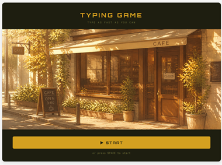
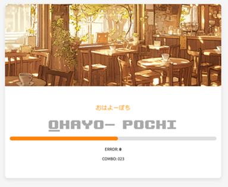
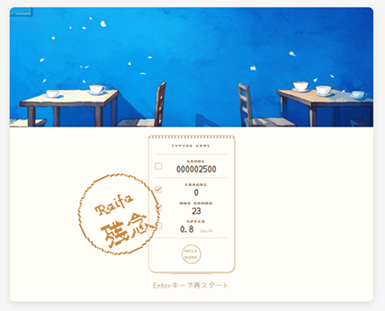

# typing-game

javascriptとAIの利用法の勉強を兼ねて  
typingゲームを作成

遊び方  
https://chc1129.github.io/typing-game/  
上のサイトにアクセス  
スペースかスタートボタンを押下でゲーム開始

スタート画面  
  
プレイ画面  
  
結果画面

参考
font:Upheaval  
https://ja.fonts2u.com/upheaval-tt--brk-.%E3%83%95%E3%82%A9%E3%83%B3%E3%83%88

google fonts:Yomogi, DotGothic16, Ultra, Orbitron, Noto Sans JP, Roboto Mono

ドット絵は以下サイトを利用して作成  
https://neutralx0.net/tools/dot3/

https://web.save-editor.com/pic/pic_twitter_header_for_logo_retro_game.html

音源は以下サイトを利用  
https://soundeffect-lab.info/sound/machine/  
キーボード1

https://on-jin.com/sound/meka.php?bunr=%E3%83%AC%E3%82%B8%E3%82%B9%E3%82%BF%E3%83%BC&kate=%E6%A9%9F%E5%99%A8%E3%83%BB%E6%A9%9F%E6%9D%90  
レジスター・開ける02

